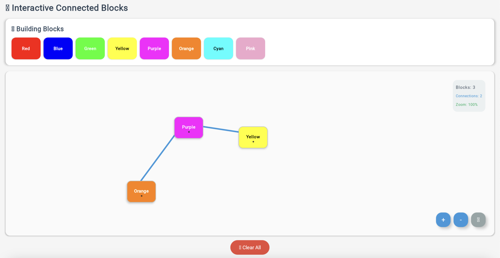

# Drag and Drop App

A simple drag and drop application built with Kotlin Multiplatform, running on Android, iOS, Web, Desktop, and Server.

## What it does

Drag items from one area and drop them into another area. Works the same way on all platforms.

## Project Structure

- **`/composeApp`** - Shared UI code for all platforms
  - `commonMain` - Code shared by all platforms
  - `androidMain` - Android-specific code
  - `iosMain` - iOS-specific code
  - `wasmJsMain` - Web-specific code
  - `desktopMain` - Desktop-specific code

- **`/iosApp`** - iOS app entry point

- **`/server`** - Backend server (Ktor)

- **`/shared`** - Shared business logic

## How to run

**Android:**
```bash
./gradlew :composeApp:installDebug
```

**iOS:**
Open in Xcode and run the `iosApp` target

**Desktop:**
```bash
./gradlew :composeApp:run
```

**Web:**
```bash
./gradlew :composeApp:wasmJsBrowserDevelopmentRun
```

**Server:**
```bash
./gradlew :server:run
```

## Screenshot


## Learn more

- [Kotlin Multiplatform](https://www.jetbrains.com/help/kotlin-multiplatform-dev/get-started.html)
- [Compose Multiplatform](https://github.com/JetBrains/compose-multiplatform/#compose-multiplatform)